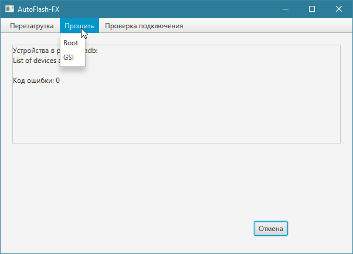

Переписаный [auto-flash-for-rmx3834](https://github.com/NTeditor/auto-flash-for-rmx3834) на Java.

# Запуск
### Требования
- **Android Platform Tools** (должно быть добавлено в `PATH`).


### Windows
1. Распакуйте архив `autoFlashFX-"ВЕРСИЯ".zip`.
2. Перейдите в папку `bin`.
3. Запустите файл `autoFlashFX-Launcher.bat`.


### Linux
К сожалению для Linux необходимо вручную [собрать](#сборка) релиз.

После сборки:
1. Распакуйте архив `autoFlashFX-"ВЕРСИЯ".zip`
2. Перейдите в папку `bin`.
3. Запустите файл `autoFlashFX-Launcher`.


# Скриншоты

### Windows



# Сборка
### Требования
- **Java 21** или выше.


### Windows
```batch
.\mvnw.bat clean javafx:jlink
```


### Linux
```bash
./mvnw clean javafx:jlink
```
